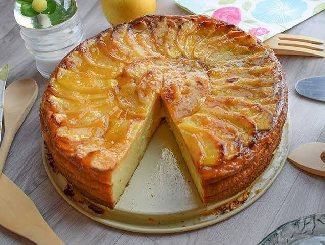

# Receta de Tarta de Manzana Casera
## Una guía sencilla y paso a paso para preparar un postre tradicional.

1. Introducción:
Hacer Hacer una tarta de manzana en casa es un proceso muy fácil si sigues las cantidades exactas.

**Consejos del chef:** Utilizar manzanas tipo Reineta. 

*Pasos previos:*
- Organizar la ccina:
	- comprar ingredientes.
	- precalentar el horno a 180ºC.
	- Engrasar el molde con mantequilla.

2. Ingredientes principales:

| Ingrediente | Cantidad | Estado |
| --- | --- | --- |
| Manzana | 4 piezas | Peladas |
| Harina | 200gr | Tamizada | 
| Huevos | 3 unidades | Temperatura ambiente | 

3. Enlaces y referencias:

Puedes encontrar más recetas en [Recetas de Cocina](https://www.marialunarillos.com/blog/)
Fotografía del plato terminado: 
<!--Tarta de manzana casera-->

*Enlace a nueva receta:* [Nueva Receta](markadown/receta_nueva.md)

